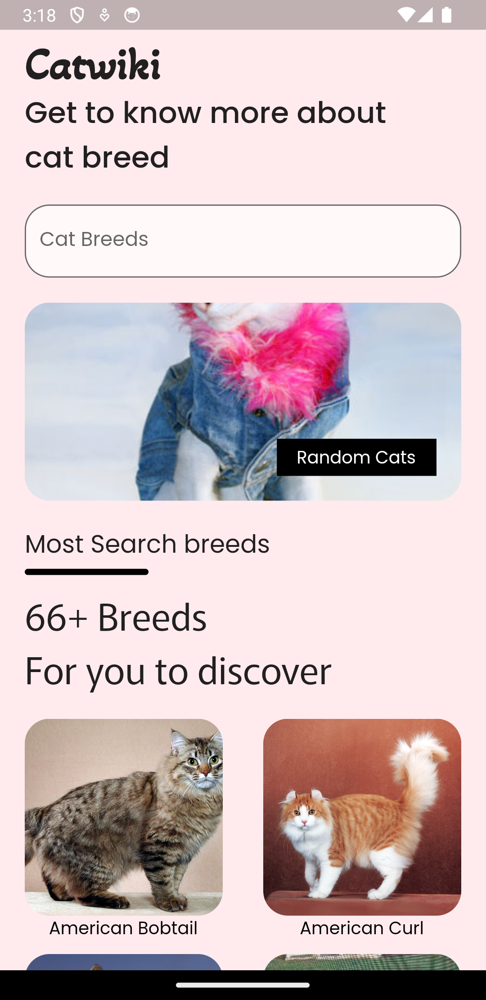
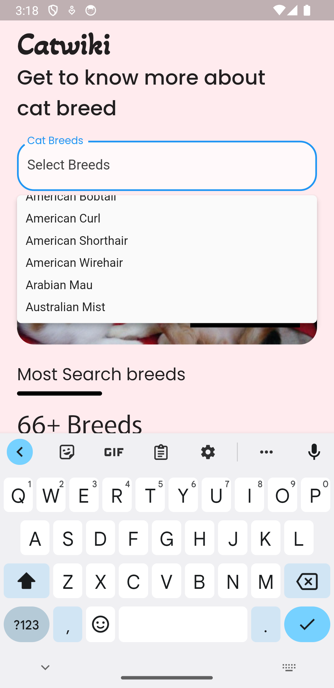
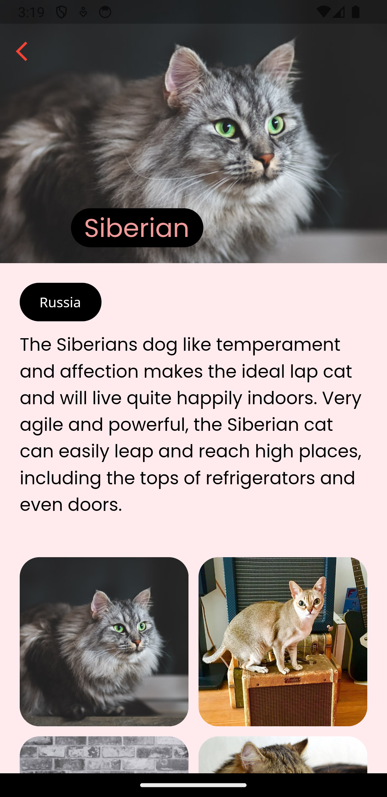

<h1 align="center">Cat breeds</h1>

</img> 
</img> 
</img> 

# FlutterWeather

A simple Cat Breed Search App created using [Flutter](https://flutter.dev/) and [Dart](https://dart.dev/) and using catwiki from [TheCatApi](https://thecatapi.com/)

## Features
- Searchable breed list
- Zoom & Clickable Item